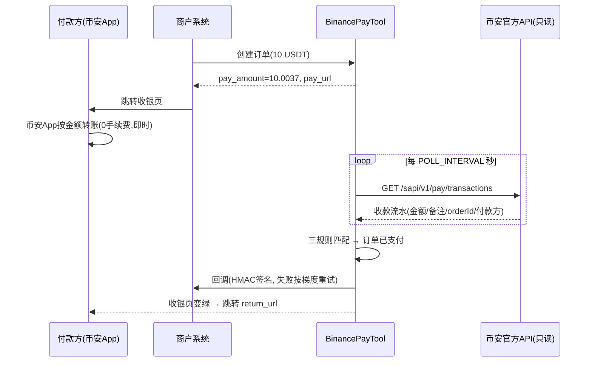

# BinancePayTool · 币安支付个人收款网关

[](https://github.com/qianyubtc/BinancePayTool/actions)
[](LICENSE)

> 用一个**普通币安个人账户**收 Binance Pay 转账，自动确认到账、回调你的业务系统。
> 单二进制部署，官方只读 API，零手续费、即时到账。
> 附 **Go / Java / PHP / Python** 四语言接入 SDK。

**本项目为社区项目，与 Binance 无任何关联。** 仓库名中的 “Binance” 仅为描述所对接的支付渠道，不代表官方授权或合作。

## 它解决什么问题

币安官方的 Binance Pay 商户 API 只对**企业实体账户**开放（个人商户账户已于 2025-02-28 终止）。
个人开发者想用币安支付收款，只剩两条野路子：逆向私有接口（违反条款、随时失效），或人工对账。

BinancePayTool 走第三条路：**只用官方公开的只读接口** `GET /sapi/v1/pay/transactions`
轮询自己账号的收款流水，用三把钥匙自动核销订单：

| 优先级 | 匹配方式 | 说明 |
|---|---|---|
| ① | **唯一金额** | 每笔订单分配唯一尾数（如 10 → 10.0037），付款金额即订单指纹，付完全自动确认 |
| ② | **备注码** | 付款方转账备注带上 6 位码，金额不准也能对上 |
| ③ | **回填编号** | 收银页里粘贴币安订单编号（18 位数字），兜底一切例外 |

关键行为均经真实账号实测（2026-09）：币安 Pay 金额支持至少 4 位小数、
付款备注原样回传、付款方 App 显示的订单编号 = 接口的 `orderId`、到账后数秒内接口可见。

## 原理



## 特性

- **单二进制 + SQLite**，无外部依赖；Docker 一行起
- 托管收银页三种付款方式按设备自动切换：**桌面扫码 / 手机一键唤起币安 App / 手动按 UID 转账**，大字金额一键复制、倒计时、状态轮询、回填入口，适配深色模式
- 内置体验页 `/demo`（默认关闭），一键部署一个公开演示站
- 唯一金额**递进式尾数**：优先 0.0001–0.0099 档（付款方最多多付一分钱级别），档位用满自动升位，同价并发容量最高 9999
- 金额冷却：订单结束后该金额 24h 不复用，杜绝迟付错配
- 回调 HMAC-SHA256 签名 + 时间戳 + nonce 防重放，`0s/15s/1m/5m/15m/1h/3h` 七次重试
- 幂等：一笔币安流水只核销一单；重复回调由商户侧按 `merchant_order_id` 幂等
- 少付/多付/过期后迟付都有明确定义（见 [docs/protocol.md](docs/protocol.md)）
- 币安 API Key **只需读取权限**，建议绑 IP 白名单；网关永不发起转账

## 快速开始

```bash
# 1. 编译（或用 Docker，见 Dockerfile 注释）
cd server && go build -o bpaygate . && cd ..

# 2. 配置
cp config.example.env config.env
./server/bpaygate -gen-key        # 生成 API_AUTH_KEY 填入 config.env
# 再填 BINANCE_API_KEY / BINANCE_API_SECRET（只勾"允许读取"）和 BINANCE_UID

# 3. 运行
./server/bpaygate -config config.env
```

创建一笔测试订单（也可直接用四语言 SDK，见下）：

```bash
# 签名规则见 docs/protocol.md §1.1，SDK 已封装，无需手写
```

```python
import sys; sys.path.insert(0, "sdk/python")
from bpaygate import BPayGate
gw = BPayGate("http://127.0.0.1:8080", "你的API_AUTH_KEY")
print(gw.create_order("TEST-1", "1", currency="USDT")["pay_url"])
```

打开返回的 `pay_url`，用另一个币安账号按页面金额转账，几秒后页面自动变为已支付。

## 商户接入

| 语言 | SDK | 示例 |
|---|---|---|
| Python | [sdk/python](sdk/python)（仅标准库） | [examples/python](examples/python) |
| PHP | [sdk/php](sdk/php)（单文件） | [examples/php](examples/php) |
| Go | [sdk/go](sdk/go)（仅标准库） | [examples/go](examples/go) |
| Java | [sdk/java](sdk/java)（Java 8+，Gson） | [examples/java](examples/java) |

接入只有三步：**创建订单 → 跳转 pay_url → 处理回调（验签 + 幂等发货）**。
协议细节（签名、字段、状态机、错误码）：[docs/protocol.md](docs/protocol.md)。
调研背景与官方接口实测结论：[docs/research.md](docs/research.md)。

## 配置

所有配置项见 [config.example.env](config.example.env)，每项都有注释。最常调的：

| 配置 | 默认 | 说明 |
|---|---|---|
| `POLL_INTERVAL` | 4 | 轮询秒数。接口权重 3000/次、限额 180000/分钟，最低可到 1 |
| `ORDER_TTL` | 900 | 订单有效期（秒） |
| `AMOUNT_DECIMALS` | 4 | 唯一金额小数位（实测币安支持至少 4） |
| `SUFFIX_MODE` | add | add=多收尾数 / sub=少收尾数 |
| `EXPIRED_GRACE` | 1800 | 过期后宽限期，期内精确到账仍自动确认 |
| `RECEIVE_LINK` | 空 | 收款二维码解码出的链接；配置后启用扫码与唤起 App 两种方式 |
| `DEMO_ENABLED` | false | 开启 `/demo` 体验页 |

部署到 VPS + Cloudflare 域名：[docs/deploy.md](docs/deploy.md)（含 systemd、Caddy、Cloudflare Tunnel 配置）。

## 必读：风险与边界

- **条款风险**：币安条款不允许未经书面同意将服务用于商业目的（Terms §28(c)）。
  个人账户跑收款网关属于灰色地带，**账号被风控的后果自担**。建议：专号收款、
  控制频率、余额及时转走；量大后注册企业实体走官方商户 API。
- **本网关只读**：不代付、不退款。退款需在币安 App 里手动转回（流水里有付款方信息）。
- **备注不可靠**：部分付款路径（如扫码）可能填不了备注，所以备注只是第二钥匙。
- **underpaid 需人工**：实付少于应付只报状态不自动补齐，商户自行决定放行或退回。
- 收款账户的 API Key 只给读取权限；`API_AUTH_KEY` 泄漏 = 任何人都能创建订单和伪造回调，妥善保管。

## Roadmap

- [ ] 易支付（epay）兼容层：独角数卡等现有系统零代码接入
- [ ] MySQL 支持与多收款账号轮换
- [ ] 简易管理面板（订单查询、手动补单、Telegram 通知）
- [ ] 多商户 key

## 相关项目

链上收款方案（不依赖币安账号）：[BEpusdt](https://github.com/v03413/BEpusdt) ·
[epusdt](https://github.com/GMWalletApp/epusdt) · [TokenPay](https://github.com/LightCountry/TokenPay)。
本项目与它们互补：Pay 内部转账零手续费、即时、无链上确认等待，但绑定币安生态。

## 支持本项目

如果这个项目帮到了你，欢迎 Star / 提 Issue / 交 PR。

还没有币安账号的话，用作者的邀请链接注册就是最好的支持（你省手续费的同时还支持了作者），邀请码 **QY333**：

- 官方域名：<https://accounts.binance.com/register?ref=QY333>
- 备用镜像（部分地区）：<https://www.bsmkweb.click/register?ref=QY333>

## License

[MIT](LICENSE)
